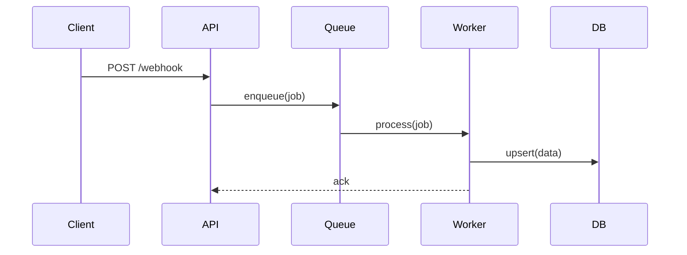

# CONTEXT.md — HerPlex

> Дополнение к README.md. Содержит договорённости, детали реализации, историю решений.
> Обновляется после каждой сессии или задачи.
> При старте новой сессии: «прочитай CONTEXT.md».

---

## Режим работы

- Архитектура и ТЗ — Perplexity / Claude Sonnet 4.6 Thinking
- Реализация, рутина, фиксы — Hermes + Nex N2 Pro (лимит 1000 req/день)
- GitHub — шина передачи контекста между агентами (ссылки на файлы, коммиты, диффы)
- Perplexity имеет доступ к GitHub; Hermes имеет доступ к файловой системе, GitHub, почте
- Переключение между агентами — через тебя, ты остаёшься точкой принятия решений
- Локальные модели (LM Studio / Ollama) не используются в этом pipeline

---

## Роли агентов

| Агент | Роль | Когда использовать |
|---|---|---|
| Perplexity / Claude Sonnet 4.6 | Архитектор, ревьюер | Архитектура, ТЗ, сложный debug, финальный review |
| Hermes + Nex N2 Pro | Исполнитель | Реализация по спеке, рутина, типовые фиксы, boilerplate |

---

## Pipeline (полный цикл фичи)

```
1. [Perplexity] Архитектура + технологии + trade-offs
2. [Perplexity] Спека (ТЗ) → ты формулируешь промпт для Hermes
3. [Hermes]     Реализация по промпту
4. [Ты]         Тесты
5a. Баг очевиден → [Hermes] фикс → п.4
5b. Архитектурные сомнения → [Perplexity] review → [Hermes] фикс → п.4
6. Финал
```

**Правило одного запроса:** Perplexity используется для консолидированного ответа, не для диалога в цикле. Итерации — роль Hermes.

---

## Триггеры переключения агентов

| Ситуация | Куда |
|---|---|
| Задача очевидна, scope ясен | Hermes напрямую |
| Задача нетривиальная, scope неясен | Perplexity → промпт → Hermes |
| Hermes завис > 3 итераций | Стоп → Perplexity с URL файла |
| Баг очевиден | Hermes напрямую |
| Финальный review критичной фичи | Perplexity с URL коммита |
| Нужна актуальная инфо (API, библиотеки) | Perplexity (web search) |

---

## Прямой канал Hermes ↔ Perplexity

Файл `HerPlex.md` — прямой и непосредственный канал связи между агентами.

Использование:

- Hermes пишет в `HerPlex.md` оценки, риски, идеи, вопросы и предложения.
- Perplexity отвечает в блоке `## Ответ Perplexity`.
- Владелец проекта принимает финальное решение в блоке `## Решение владельца`.
- Файл не заменяет GitHub-ссылки на коммиты/диффы, а дополняет их живым контекстом.

---

## Передача контекста через GitHub

```
Файл:    github.com/AlexanderKuzikov/HerPlex/blob/main/[path]
Коммит:  github.com/AlexanderKuzikov/HerPlex/commit/[hash]
Дифф:    github.com/AlexanderKuzikov/HerPlex/compare/[hash1]..[hash2]
Канал:   github.com/AlexanderKuzikov/HerPlex/blob/main/HerPlex.md
```

Perplexity получает контекст через URL — не через copy-paste. Это исключает буфер обмена из процесса.

---

## Структура архитектурного документа

```markdown
## Context
Что за система, какую проблему решает, масштаб.

## Decision
Какой подход выбран и почему (одна-две фразы).

## Constraints
- Нельзя менять зависимости
- Нельзя трогать src/legacy/*
- Формат ответа API фиксирован

## Out of scope
Что явно НЕ делаем в этой итерации.
```

Архитектура описывает **границы**, а не детали реализации. Детали — в ТЗ.

---

## Структура ТЗ (промпт для Hermes)

```
Task: [одна строка — что должно работать после]

Modify:
- src/api/[file].ts — [что изменить]

Read for context:
- src/db/schema.ts

Acceptance criteria:
- [ ] [конкретное поведение]
- [ ] [edge case]

Do NOT:
- Не менять [интерфейс/схему/другой файл]
- Не добавлять [зависимость/логирование]

Stop after: [точная точка остановки]
```

**Правило размера:** одна задача = одно логическое изменение = один коммит.
Разбить если: затрагивает > 3 файлов, > 5 acceptance criteria, есть архитектурная неопределённость.

---

## Правила формулировки задач для Hermes

```
✓ "Read .env, return PORT value"
✓ "In src/api/products.ts line 42 — fix type error X"
✗ "Найди порт сервера"           ← запускает agentic spiral
✗ "Разберись с ошибкой"          ← нет scope, нет файла
```

Простые вопросы формулировать как конкретные действия, не как открытые задачи.

---

## Диаграммы и схемы

**Использовать Mermaid** — рендерится в GitHub, читается Hermes как текст, генерируется Perplexity.

Когда нужна диаграмма:
- Многошаговый async flow (очереди, webhooks)
- Взаимодействие нескольких модулей
- Структура БД с relations
- State machine

Когда не нужна:
- Простой CRUD endpoint
- Линейный скрипт
- Очевидная иерархия файлов

Пример:


---

## Требования к коду

Хранятся в `AGENTS.md`. Ключевые принципы:
- Функции максимум 40 строк — если длиннее, разбить
- Запрещено `any` и `as`-casting без комментария с причиной
- Validation: Zod-схемы только в `src/schemas/`
- DB queries: только через `src/db/queries/`
- Error handling: typed throws, не возвращать null
- Нет try/catch в handlers — есть global error middleware

---

## Требования к комментариям

- Комментарий = ПОЧЕМУ, не ЧТО
- Хаки и workaround: обязательный комментарий с причиной
- TODO формат: `TODO(2026-06): описание`
- Без JSDoc на очевидные функции

```typescript
// ✓ offset+1 because legacy API counts from 1, not 0
const rows = await getProducts(limit, offset + 1)

// ✗ get products from database
const rows = await getProducts(limit, offset)
```

---

## Skills в Hermes

**Механика:** SKILL.md файлы в `~/.hermes/skills/`. Загружаются по slash-команде `/skill-name` по паттерну progressive disclosure — сначала только индекс (~3k токенов), полный контент только когда нужен.

**Глобальный skill:** `~/.hermes/skills/dev/task-formulation/SKILL.md`
→ скопировать из `skills/task-formulation/SKILL.md` этого репо

**Bundle для фича-цикла:**
```bash
hermes bundles create feature-dev \
  --skill ts-conventions \
  --skill task-formulation \
  -d "Full feature cycle with conventions"
```

**Автоматические skills:** Hermes создаёт skills сам после нетривиальных задач.
Контроль через `write_approval: true` в `~/.hermes/config.yaml`.
Проверка: `/skills pending` → `/skills approve`.

---

## Настройка Hermes (config.yaml)

```yaml
# ~/.hermes/config.yaml
agent:
  max_tool_calls_per_turn: 10
  max_tokens_per_turn: 50000
  clarify_before_acting: true
  auto_compact: true
skills:
  write_approval: true
```

---

## Команды управления Hermes в реальном времени

```
/stop                              # немедленная остановка
/plan                              # показать план ДО выполнения
/compress                          # сжать контекст при росте
/skills pending                    # посмотреть auto-generated skills
/skills approve                    # апрувить pending skill
"Wait. Answer only, no tool calls needed."
"Stop. Report what you found so far."
```

`/plan` использовать перед любой задачей с > 5 файлами.

---

## Правила HerPlex scope

- `C:\Any` — только рабочая/стейджинг-копия.
- Все задания, решения и authoritative-контент HerPlex берутся только из GitHub.
- `HerPlex.md` трогать только если это явно указано в `Modify` или `Stop after`.
- Если пользователь попросил только ответить — никаких tool calls.
- Простая задача должна завершаться без диагностики, улучшений и смежных файлов.
- Если задача требует > 5 шагов или > 10 минут без прогресса — остановиться и спросить владельца.

---

## Проблема agentic spiral и решения

Симптом: Hermes делает десятки tool calls на простой вопрос, тратит сотни тысяч токенов.

Причины:
1. Размытая задача без scope
2. Нет stopping criteria
3. Нет `clarify_before_acting` в конфиге

Решения (в порядке приоритета):
1. Точная формулировка с явными файлами и `Stop after:`
2. `clarify_before_acting: true` в config.yaml
3. `max_tool_calls_per_turn: 10` как жёсткий потолок
4. `/stop` при первых признаках зацикливания
5. Сложные/неясные задачи сначала через Perplexity для формулировки промпта

---

## Файловая структура репо

```
HerPlex/
├── HerPlex.md             ← прямой канал Hermes ↔ Perplexity
├── AGENTS.md              ← правила для Hermes (читается автоматически)
├── PERPLEXITY.md          ← шпаргалка по работе с Perplexity
├── CONTEXT.md             ← договорённости, история решений, детали
├── TODO.md                ← плоский таск-лист
├── docs/                  ← описание pipeline и процессов
├── templates/             ← шаблоны задач и review
├── examples/              ← пример полного feature cycle
└── skills/
    └── task-formulation/
        └── SKILL.md       ← как формулировать задачи для Hermes
```

`AGENTS.md` — не трогать без явной причины, Hermes читает его каждую сессию.
`CONTEXT.md` — обновлять после каждой сессии.
`HerPlex.md` — прямой канал Hermes ↔ Perplexity; ответы Perplexity и решения владельца фиксируются там же.

---

## История решений

| Дата | Решение | Причина |
|---|---|---|
| 2026-06-14 | GitHub как шина контекста между агентами | Единственный общий инструмент, audit trail, no extra infra |
| 2026-06-14 | HerPlex.md как прямой канал Hermes ↔ Perplexity | Живой контекст для оценок, вопросов, ответов и решений без copy-paste |
| 2026-06-14 | Без Issues/PR для соло-разработки | Оверинжиниринг для одного человека |
| 2026-06-14 | AGENTS.md + PERPLEXITY.md + CONTEXT.md | Минимальный набор для сохранения контекста между сессиями |
| 2026-06-14 | write_approval: true для Hermes skills | Контроль над auto-generated skills |
| 2026-06-14 | max_tool_calls_per_turn: 10 | Жёсткий потолок против agentic spiral |
| 2026-06-14 | Perplexity — consolidated запрос, не цикл | Экономия контекста, чёткое разделение ролей |

---

## Текущий статус

- [x] Базовая архитектура pipeline определена
- [x] AGENTS.md создан
- [x] PERPLEXITY.md создан
- [x] TODO.md создан
- [x] Skill task-formulation создан
- [x] README.md с бэджиками
- [x] CONTEXT.md с полной документацией
- [x] HerPlex.md создан как прямой канал Hermes ↔ Perplexity
- [x] Документация обновлена под канал Hermes ↔ Perplexity
- [x] Добавлены docs/pipeline.md, templates/task.md, templates/review.md
- [x] Добавлены docs/agent-contract.md и docs/quality-gates.md
- [x] Добавлен пример examples/feature-cycle как placeholder полного цикла
- [ ] Скопировать skill в `~/.hermes/skills/dev/task-formulation/`
- [ ] Настроить `~/.hermes/config.yaml` (max_tool_calls, clarify_before_acting, write_approval)
- [ ] Адаптировать AGENTS.md под первый конкретный проект
